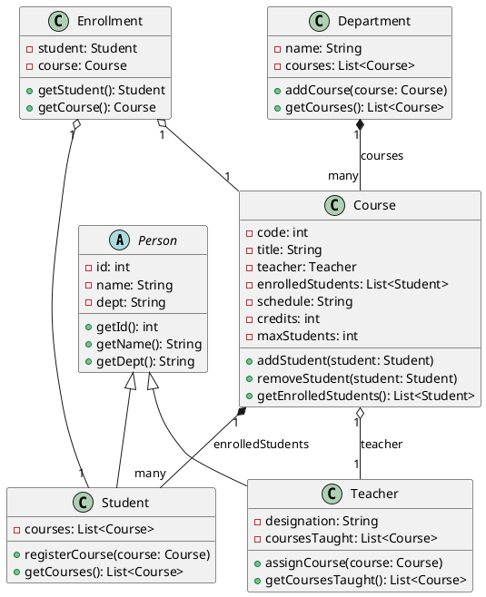
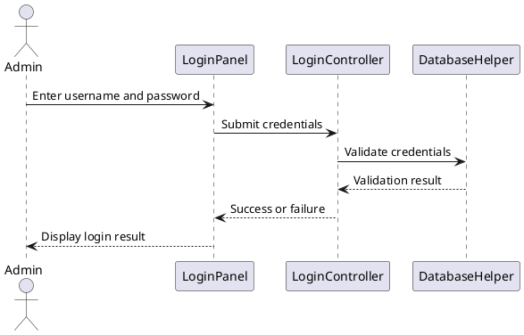
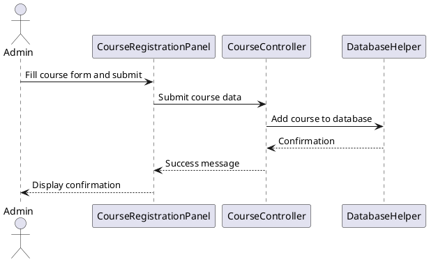
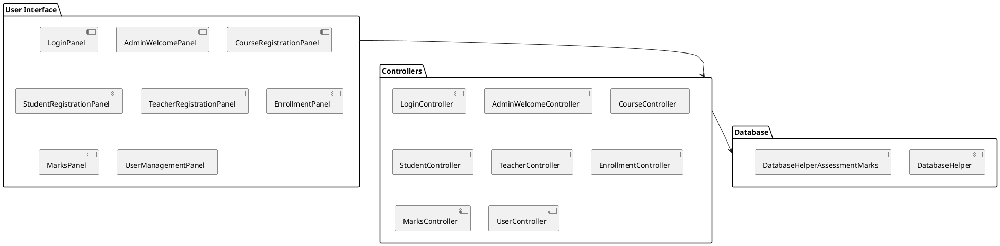

This documentation covers the primary GUI components and their roles within the Course Management software. For detailed implementation, refer to the source code in the `src/view` directory.
=======
---

## 8. Visual Diagrams and Technical Details

### 8.1 UML Class Diagram



*This UML class diagram illustrates the main classes and their relationships, showing inheritance, composition, and associations.*

---

### 8.2 Sequence Diagrams

#### 8.2.1 Login Flow



#### 8.2.2 Course Registration Flow



*These sequence diagrams depict the interaction between user interface, controller, and database during login and course registration.*

---

### 8.3 Component Diagram



*The component diagram shows the modular structure of the system and the interactions between UI, controllers, and database helpers.*

---

### 8.4 Flowcharts

#### 8.4.1 Student Registration Algorithm

```plaintext
+---------------------+
| Start               |
+---------------------+
          |
          v
+---------------------+
| Input student data   |
+---------------------+
          |
          v
+---------------------+
| Validate input       |
+---------------------+
          |
          v
+---------------------+
| Add student to DB    |
+---------------------+
          |
          v
+---------------------+
| Display success msg  |
+---------------------+
          |
          v
+---------------------+
| End                 |
+---------------------+
```

#### 8.4.2 Course Enrollment Algorithm

```plaintext
+-----------------------------+
| Start                       |
+-----------------------------+
            |
            v
+-----------------------------+
| Select student and course   |
+-----------------------------+
            |
            v
+-----------------------------+
| Check course capacity       |
+-----------------------------+
            |
     +------+------+
     |             |
     v             v
+---------+   +-----------------+
| Not full|   | Full            |
+---------+   +-----------------+
     |             |
     v             v
+-----------------------------+
| Enroll student in course    |
+-----------------------------+
            |
            v
+-----------------------------+
| Display success message     |
+-----------------------------+
            |
            v
+-----------------------------+
| End                         |
+-----------------------------+
```

#### 8.4.3 Login Process Algorithm

```plaintext
+---------------------+
| Start               |
+---------------------+
          |
          v
+---------------------+
| Enter username       |
+---------------------+
          |
          v
+---------------------+
| Enter password       |
+---------------------+
          |
          v
+---------------------+
| Validate credentials |
+---------------------+
          |
     +----+----+
     |         |
     v         v
+--------+ +------------+
| Success| | Failure    |
+--------+ +------------+
     |         |
     v         v
+---------------------+
| Display message     |
+---------------------+
          |
          v
+---------------------+
| End                 |
+---------------------+
```

#### 8.4.4 Course Search Algorithm

```plaintext
+---------------------+
| Start               |
+---------------------+
          |
          v
+---------------------+
| Enter course ID      |
+---------------------+
          |
          v
+---------------------+
| Validate input       |
+---------------------+
          |
          v
+---------------------+
| Search course in DB  |
+---------------------+
          |
     +----+----+
     |         |
     v         v
+--------+ +------------+
| Found  | | Not found  |
+--------+ +------------+
     |         |
     v         v
+---------------------+
| Display details or   |
| error message       |
+---------------------+
          |
          v
+---------------------+
| End                 |
+---------------------+
```

#### 8.4.5 Grade Report Generation Algorithm

```plaintext
+---------------------+
| Start               |
+---------------------+
          |
          v
+---------------------+
| Enter course ID      |
+---------------------+
          |
          v
+---------------------+
| Validate input       |
+---------------------+
          |
          v
+---------------------+
| Generate report from |
| DB                  |
+---------------------+
          |
          v
+---------------------+
| Display report       |
+---------------------+
          |
          v
+---------------------+
| End                 |
+---------------------+
```

#### 8.4.6 Enrollment Removal Algorithm

```plaintext
+---------------------+
| Start               |
+---------------------+
          |
          v
+---------------------+
| Select course       |
+---------------------+
          |
          v
+---------------------+
| Select student      |
+---------------------+
          |
          v
+---------------------+
| Remove enrollment   |
+---------------------+
          |
          v
+---------------------+
| Refresh UI          |
+---------------------+
          |
          v
+---------------------+
| Display success msg |
+---------------------+
          |
          v
+---------------------+
| End                 |
+---------------------+
```
+---------------------+
+---------------------+
+-----------------------------+
+---------------------+

*These flowcharts illustrate the step-by-step process for student registration and course enrollment.*

---

### 8.5 Technical Details

- The UML class diagram reflects the core data model and relationships, supporting OOP principles such as inheritance and composition.
- Sequence diagrams demonstrate the flow of control and data between UI, controllers, and database during key operations.
- The component diagram highlights the modular architecture, showing clear separation of concerns.
- Flowcharts provide a visual representation of the main algorithms, aiding understanding and maintenance.
- All diagrams are represented in PlantUML syntax for easy visualization and modification.
- The system uses Java Swing for UI, controllers for business logic, and database helpers for data persistence, following MVC architecture.

---

This section enhances the documentation with visual and technical insights, improving clarity and professionalism.
